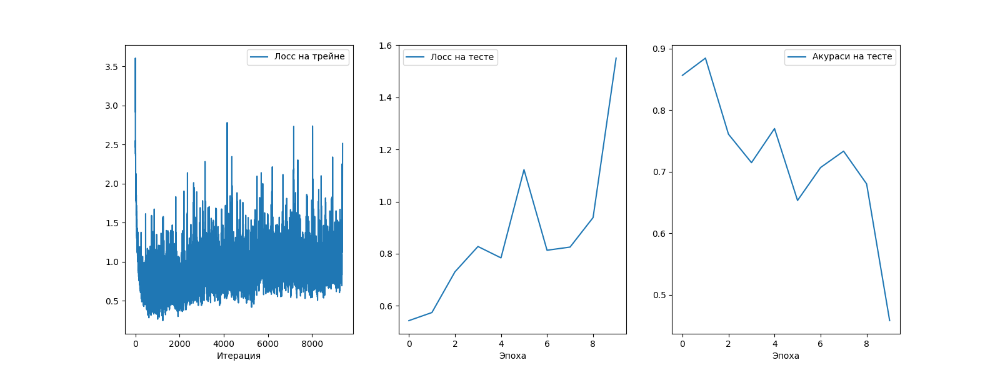
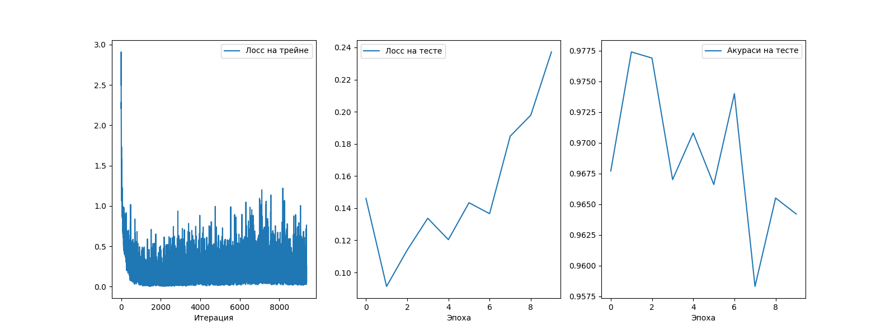
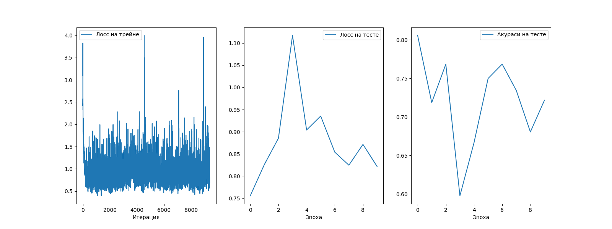

### Краткий отчёт

Запуски на датасете MNIST

#### Запуск модели

Есть ещё много параметров, которые задают пространство для отображения, но они будут лишними для упоминания

```bash
$ python mnist.py --epoch=N --lambda1=P
```

#### Схема работы модели

Image => | ConvNet (Euclid) | => Проекция в гиперболическое пр-во => | Classifier (Hyperbol) | => predicted class

Модель учиться строить эмбединги в процессе обучения классификатора, если бы изначально пришлось писать модель для эмбедингов, то
пришлось бы переписывать TripleLoss или любой другой подобный лосс, потому что понятие расстояния отличается (но близко по смыслу к косинусному)

В процессе добавлена регуляризация из статьи ~  $\mathit{L_reg} = \lambda \frac{1}{||x||}$ (https://arxiv.org/pdf/2204.08176), можно добавить контрастивный лосс.

#### Результат запуска тестов





Выводы странные, модель почему-то переобучилась, хотя никогда прежде такого не было. В других запусках модель с регуляризацией показывала немного, но лучше (порядка 1% от всего датасета)
